# Automated S3 Bucket Cleanup Using AWS Lambda and Boto3

## Objective
Automatically delete files older than 30 days in a specific Amazon S3 bucket using an AWS Lambda function triggered manually or periodically.

---

## How to use this automation

### Step 1: Identify an existing or create a new S3 Bucket
1. Navigate to S3 console within **AWS Management Console**
2. Identify an existing Bucket or Click **Create bucket** to create a new one.
3. When creating a new Bucket, enter a unique bucket name (e.g., `my-automated-cleanup-bucket-<name>`) and choose your preferred AWS Region.
4. Choose the required S3 Bucket settings (eg. Disable Public Access settings, enable default encryption) and click **Create bucket**.
5. Upload the required files (e.g., `file1.txt`, `file2.txt`, `image.jpg`) and wait for the upload to complete.
   > *Note: S3 objects have a read-only `LastModified` date set on creation. To simulate files older than 30 days without waiting, you will temporarily adjust the retention threshold in the Lambda function to `0` days during testing so that all current files are cleaned up.*

<details open>
<summary>📸 Click to view S3 Bucket Setup & Upload Screenshots</summary>

| S3 Bucket Setup | Uploading Files |
|:---:|:---:|
| 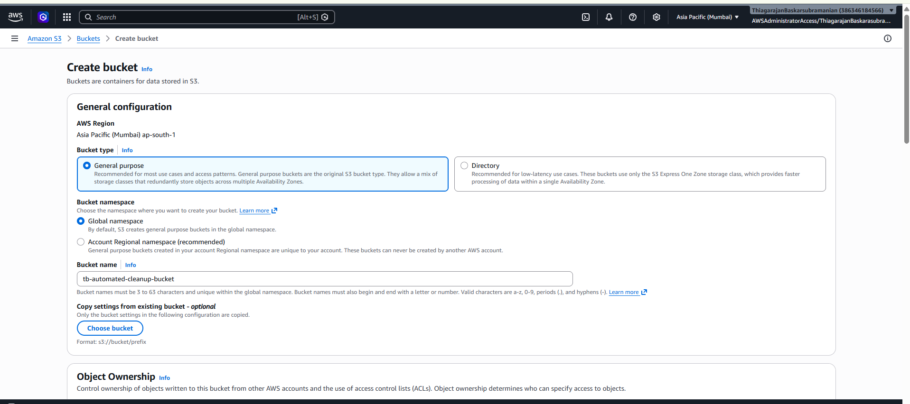 | 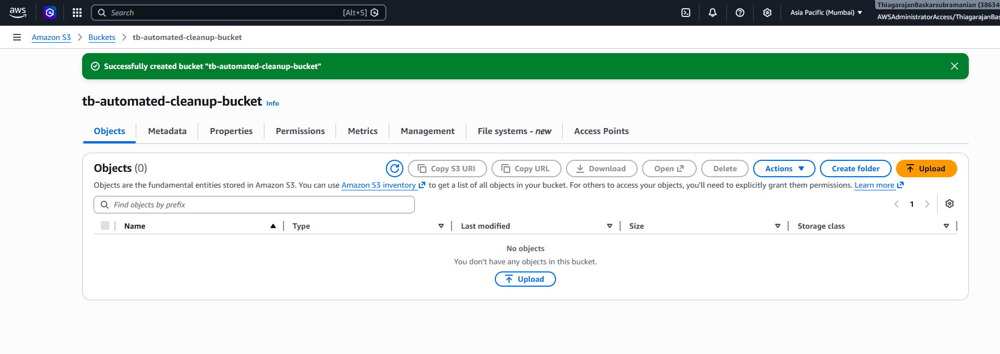 |
| 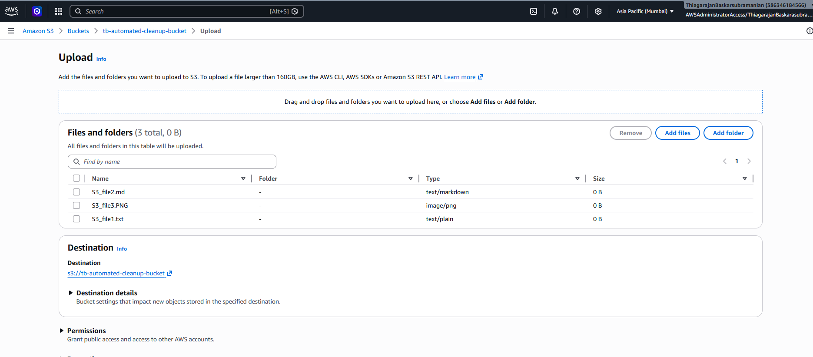 | 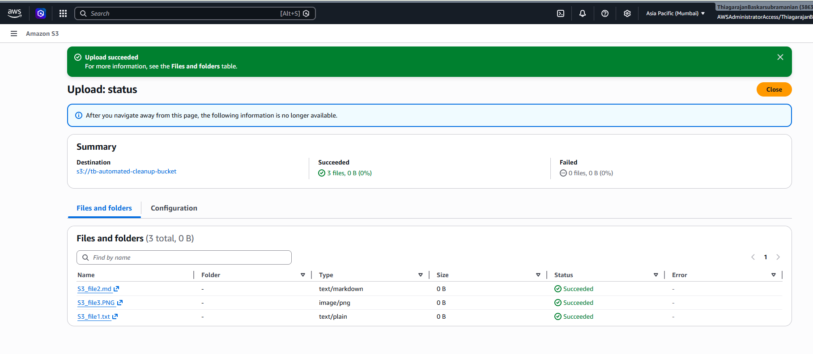 |
|  | |

</details>

---

### Step 2: Give required S3 permissions to Lambda that automates deletion of old S3 files
1. Navigate to the **IAM Console**.
2. Select **Roles** from the left navigation pane and click **Create role**.
3. Choose **AWS service** as the trusted entity type, and select **Lambda** under service use cases. Click **Next**.
4. Search for and attach the policy **`AmazonS3FullAccess`** (in production, you would restrict this to your specific bucket, but this is fine for this assignment). Click **Next**.
5. Name the role `LambdaS3CleanupRole` and click **Create role**.

<details open>
<summary>📸 Click to view IAM Role Configuration Screenshots</summary>

| Trust Policy Setup | Policy Assignment & Review |
|:---:|:---:|
| 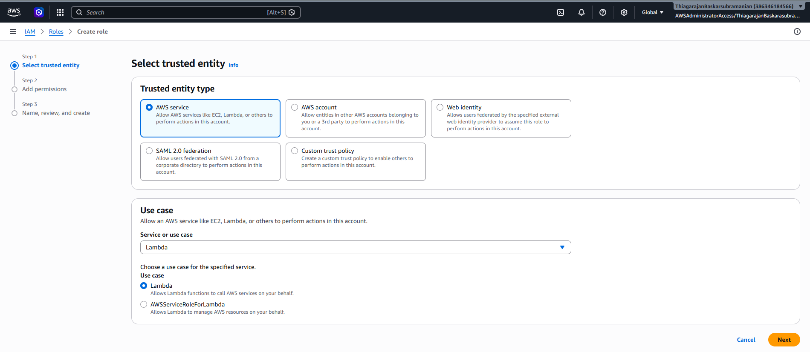 | 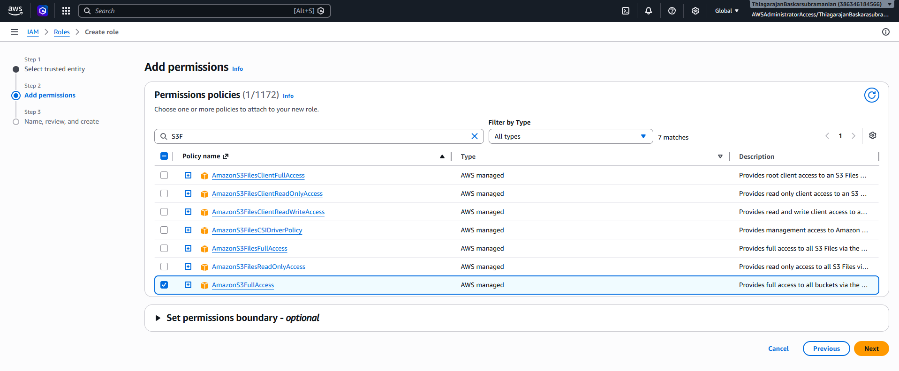 |
| 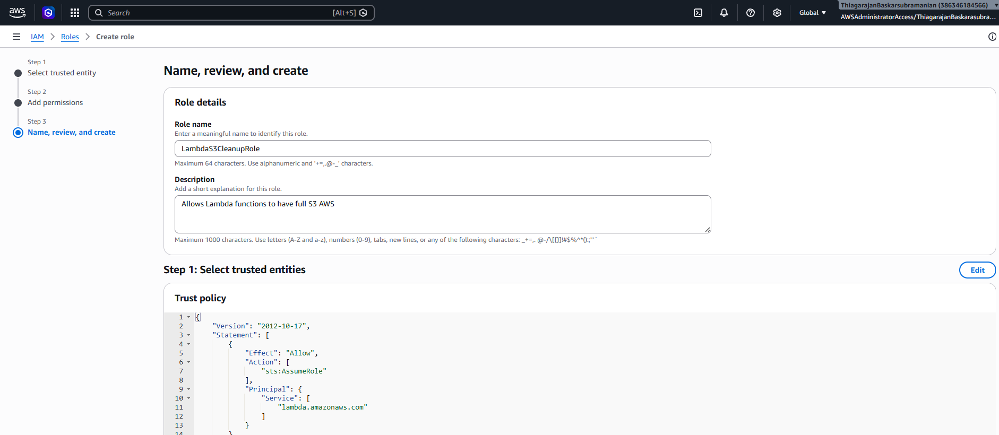 | 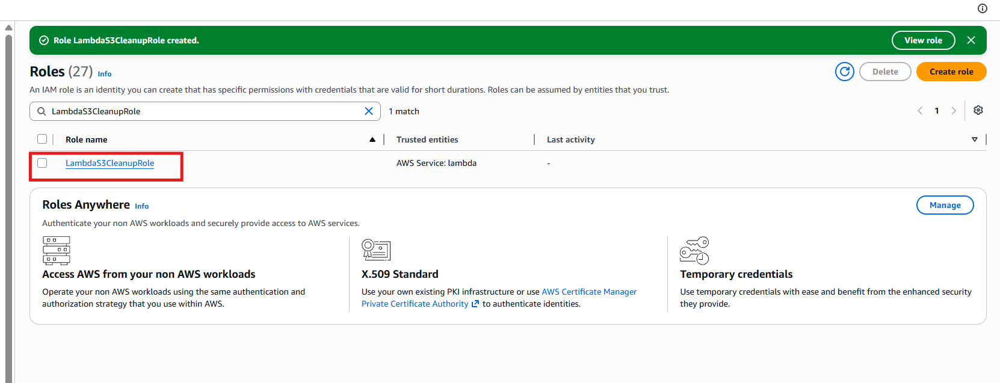 |

</details>

---

### Step 3: Set Up the AWS Lambda Function
1. Navigate to the **Lambda Console** and click **Create function**.
2. Select **Author from scratch**.
3. Configure the settings:
   - **Function name**: `S3BucketCleanup`
   - **Runtime**: `Python 3.x` (e.g., Python 3.13)
   - **Execution role**: Choose **Use an existing role** and select `LambdaS3CleanupRole` from the list.
4. Click **Create function**.
5. In the Lambda Editor:
   - Double-click `lambda_function.py`.
   - Replace the default code with the code provided in [lambda_function.py](./lambda_function.py).
   - Click **Deploy** to save and compile the changes.

<details open>
<summary>📸 Click to view Lambda Function Setup Screenshots</summary>

| Lambda Function Setup | Code Editor & Deploy |
|:---:|:---:|
| 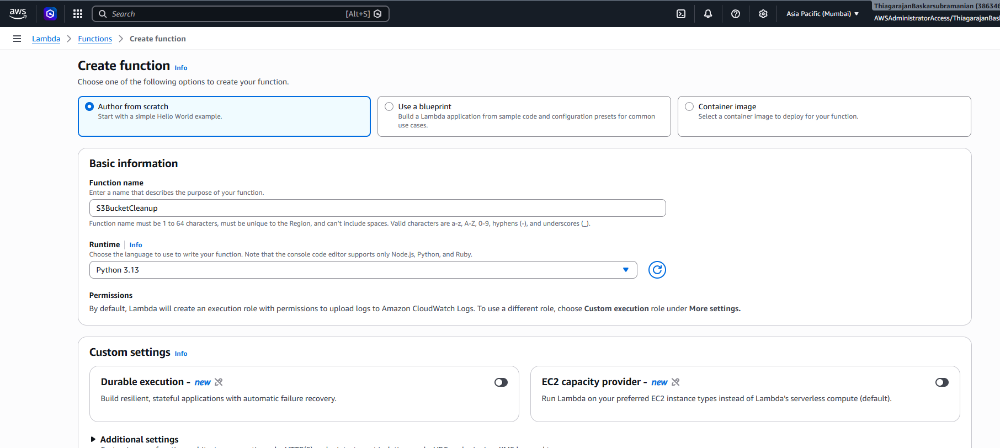 | 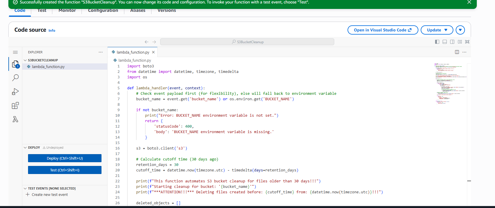 |
| 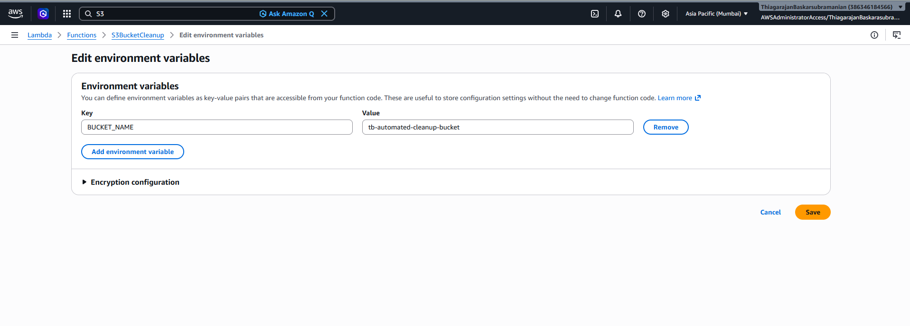 | |

</details>

---

### Step 4: How Lambda knows about the S3 bucket it needs to clean up?
There are two options:
1. **Using Environment Variable** 
   - In the Lambda function console, click on the **Configuration** tab.
   - Select **Environment variables** from the sidebar and click **Edit**.
   - Add a new variable:
     - **Key**: `BUCKET_NAME`
     - **Value**: Name of the S3 bucket you created in Step 1.
   - Click **Save**.

2. **Using Event Payload for better flexibility** 
   - You can pass the bucket name in the event payload when testing or triggering the Lambda function. This will not lock us to perform this cleanup on single S3 Bucket. We can perform this cleanup on different S3 Buckets as per our requirement.
   - For example:
     ```json
     {
       "bucket_name": "your-bucket-name"
     }
     ```

<details open>
<summary>📸 Click to view Configuration & Environment Variables Screenshots</summary>

| Environment Variables Configuration | |
|:---:|:---:|
| 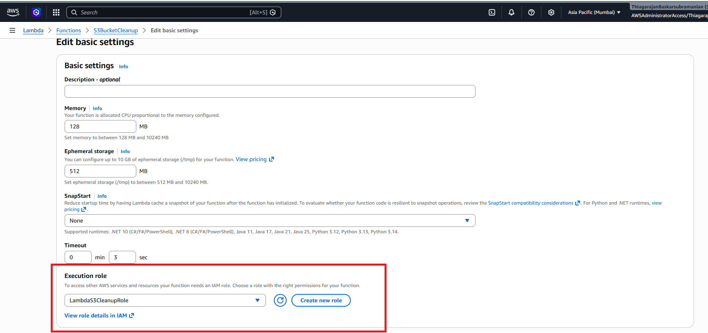 | |

</details>

---

### Step 5: Test and Verify the Cleanup
1. Click on the **Test** tab in your Lambda console.
2. Create a new test event:
   - **Event name**: `TestCleanup`
   - **Event JSON**: `{}` (leave empty if you use environment variable. Otherwise, provide the bucket name in the event payload as shown in the Step 4, Option 2)
3. Click **Save**.

#### 🧪 Testing "Older than 30 days" Simulation:
1. To test the cleanup immediately on your newly uploaded files, modify **line 19** in your Lambda function code:
   - Change `retention_days = 30` to `retention_days = 0` (this targets all files for immediate cleanup).
2. Click **Deploy**.
3. Click **Test**.
4. Review the **Execution Results**:
   - The status should show **Succeeded**.
   - The log output will list all the deleted test files.
5. Navigate back to your S3 bucket. Refresh the page to verify that the files have been successfully deleted.
6. Change the code back to `retention_days = 30` and deploy it again to finalize the deployment.

<details open>
<summary>📸 Click to view Testing & Cleanup Verification Screenshots</summary>

| Test Event Setup | Execution Result Logs |
|:---:|:---:|
| 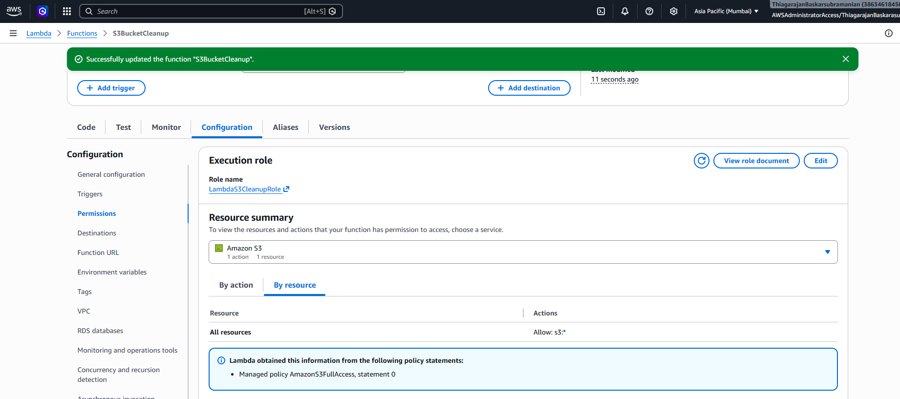 | 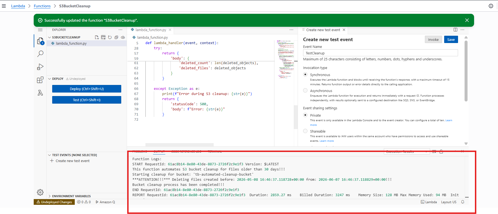 |
| 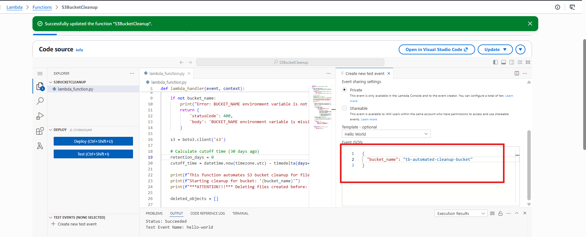 |  |

</details>

---

## Example Screenshots Gallery

All screenshots are categorized and embedded inline within each corresponding setup step above. You can open the dropdown menu in each step to view the detailed setup progress.

Below is the required final list of screenshots with their designated assignment names:

<details open>
<summary>📸 Click to view Final Required Screenshots Gallery</summary>

| Description | Screenshot |
|:---|:---:|
| **01_s3_bucket_files.png**: S3 bucket overview before cleanup | 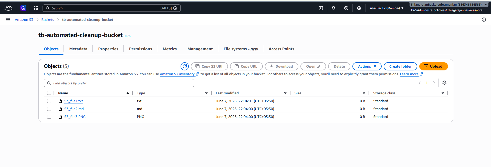 |
| **02_lambda_env_variables.png**: Lambda BUCKET_NAME environment variable |  |
| **03_lambda_test_execution.png**: Lambda execution results showing success |  |
| **04_s3_bucket_after_cleanup.png**: S3 bucket overview after cleanup | 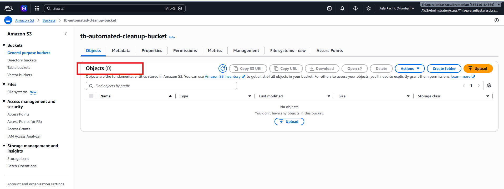 |
| **05_cloudwatch_logs.png**: CloudWatch logs showing deletion details |  |

</details>
