# Assignment 3: Monitor Unencrypted S3 Buckets Using AWS Lambda and Boto3

## Objective
Enhance AWS security posture by automatically auditing all S3 buckets in your account to detect and log any bucket lacking explicit Server-Side Encryption (SSE) configurations.

---

## Technical Context (Important Note)
> [!NOTE]
> Since January 2023, AWS automatically applies basic server-side encryption (SSE-S3) to all new S3 buckets. 
> To test this Lambda function and simulate an "unencrypted" bucket, you must delete the bucket's encryption configuration using the AWS CLI or AWS CloudShell, which makes `get_bucket_encryption` return a `ServerSideEncryptionConfigurationNotFoundError`. But this might not be possible as AWS might not allow us to delete encryption even via AWS CLI.

---

## Step-by-Step Instructions

### Step 1: Set Up Your S3 Buckets
1. Open the **AWS Management Console** and navigate to **S3**.
2. Identify or create 2-3 test buckets.
3. To simulate an unencrypted bucket for this assignment, open **AWS CloudShell** (the terminal icon in the top right corner of the AWS console) and run this command:
   ```bash
   aws s3api delete-bucket-encryption --bucket <name-of-one-of-your-test-buckets>
   ```
   This deletes the explicit encryption configuration on that bucket, allowing the Boto3 script to flag it as unencrypted.

<details open>
<summary>📸 Click to view S3 Bucket Setup & CloudShell Screenshots</summary>

| S3 Bucket Setup | S3 Status & CLI Command |
|:---:|:---:|
| 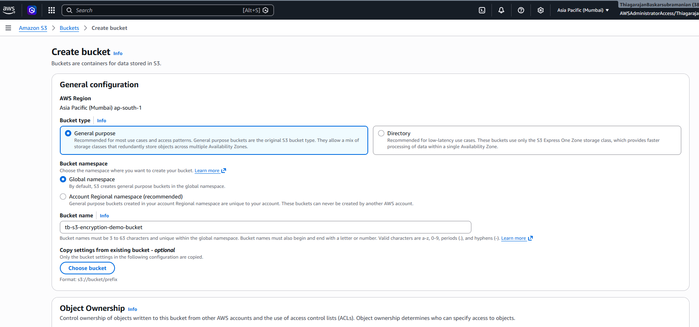 | 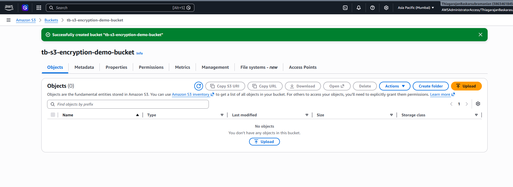 |
| 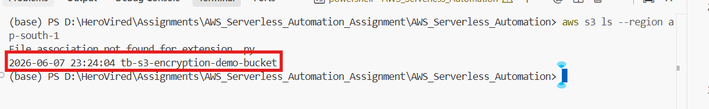 | 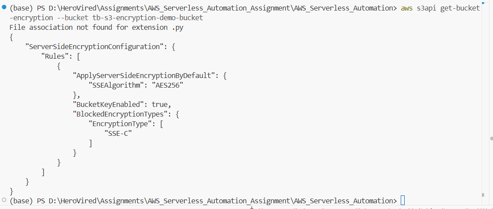 |
| 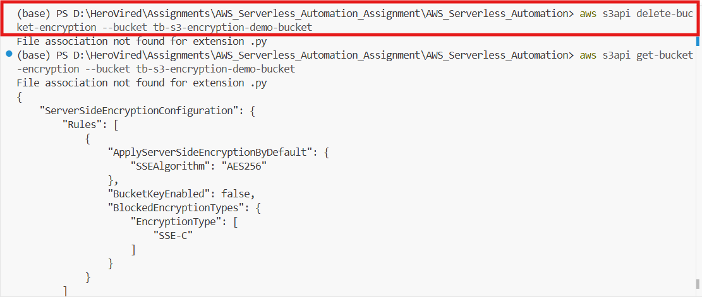 | |

</details>

---

### Step 2: Create the IAM Role for Lambda
1. Navigate to the **IAM Console**.
2. Select **Roles** -> **Create role**.
3. Choose **AWS service** -> **Lambda** as the trust use case. Click **Next**.
4. Search for and attach the policy **`AmazonS3ReadOnlyAccess`**. Click **Next**.
5. Name the role `LambdaS3ReadAccessRole` and click **Create role**.

<details open>
<summary>📸 Click to view IAM Role Configuration Screenshots</summary>

| Trust Policy Setup | Policy Assignment & Review |
|:---:|:---:|
| 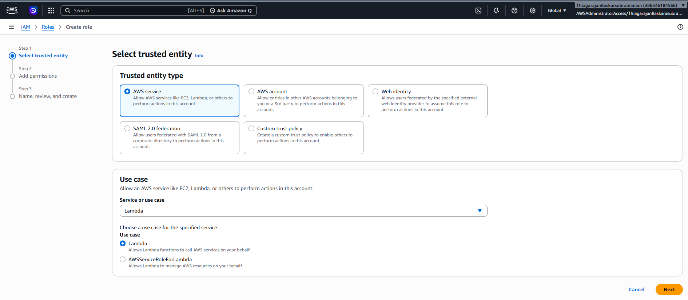 | 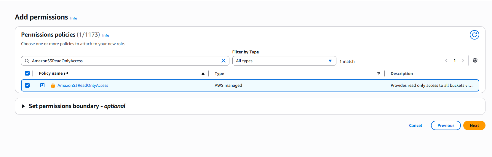 |
| 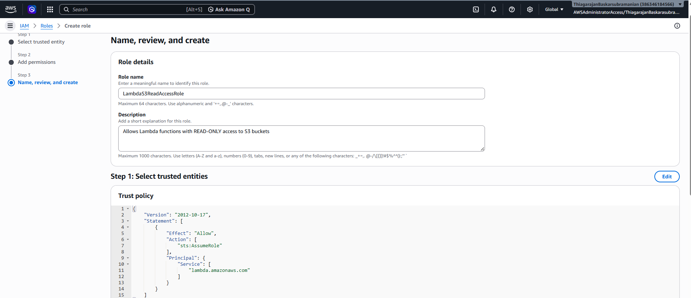 | 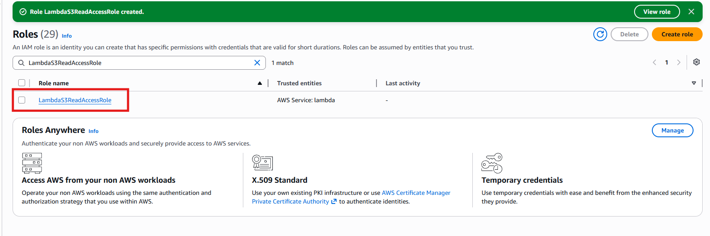 |

</details>

---

### Step 3: Create the AWS Lambda Function
1. Navigate to the **Lambda Console** and click **Create function**.
2. Select **Author from scratch**.
3. Configure the settings:
   - **Function name**: `S3EncryptionMonitor`
   - **Runtime**: `Python 3.x` (e.g., Python 3.13)
   - **Execution role**: Choose **Use an existing role** and select `LambdaS3ReadAccessRole`.
4. Click **Create function**.
5. In the Lambda Editor:
   - Double-click `lambda_function.py`.
   - Replace the default code with the code provided in [lambda_function.py](./lambda_function.py).
   - Click **Deploy** to save and compile.

<details open>
<summary>📸 Click to view Lambda Function Setup Screenshots</summary>

| Lambda Function Setup | Code Deployment |
|:---:|:---:|
| 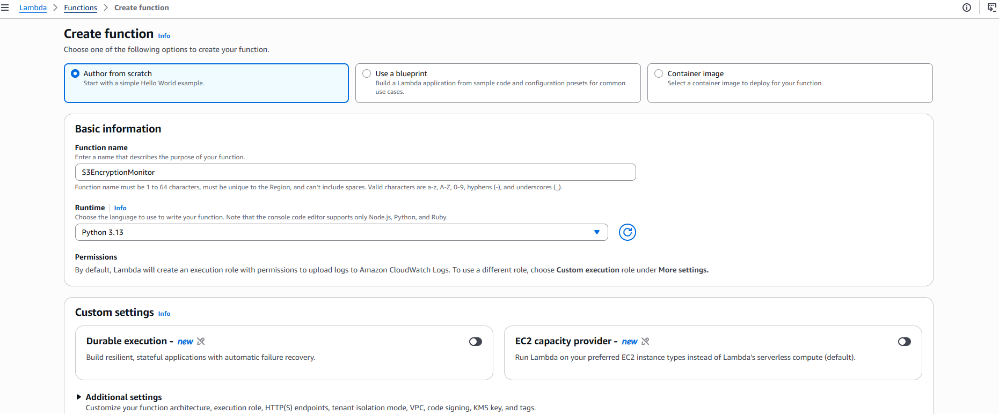 | 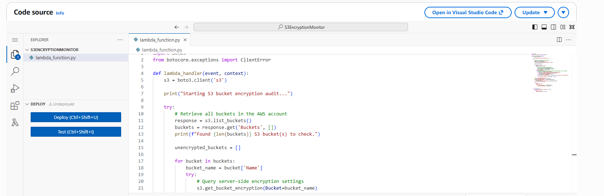 |
| 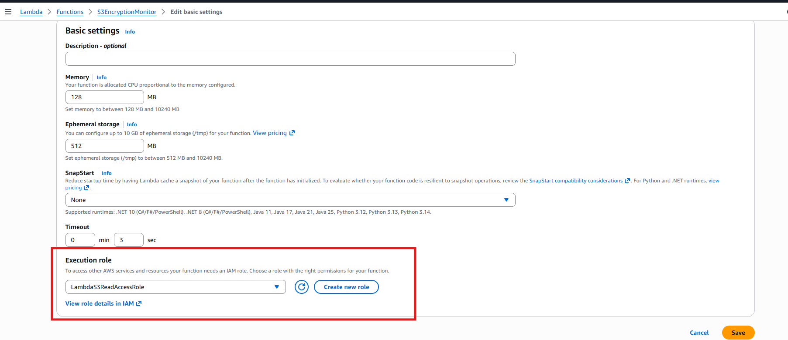 | 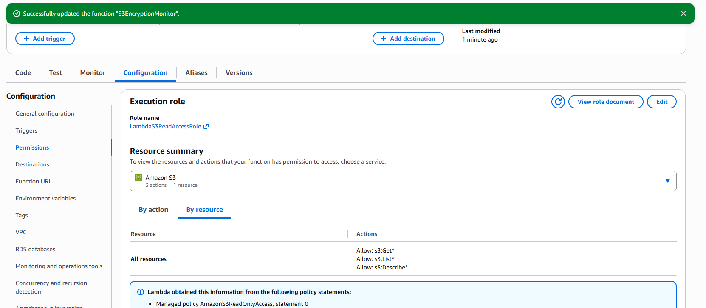 |

</details>

---

### Step 4: Test and Verify the Audit
1. Click on the **Test** tab in your Lambda console.
2. Create a new test event:
   - **Event name**: `TestAudit`
   - **Event JSON**: `{}` (leave empty JSON object)
3. Click **Save**.
4. Click **Test**.
5. Review the **Execution Results**:
   - The status should show **Succeeded**.
   - The log output will display a summary listing which buckets are encrypted and which ones are unencrypted (the one you targeted in Step 1).

<details open>
<summary>📸 Click to view Lambda Test & Verification Screenshots</summary>

| Test Run Execution | Output Verification |
|:---:|:---:|
| 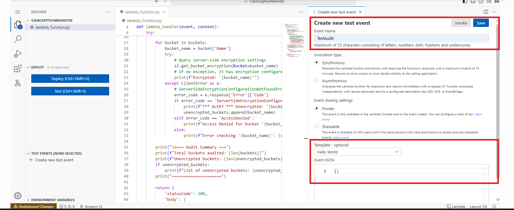 | 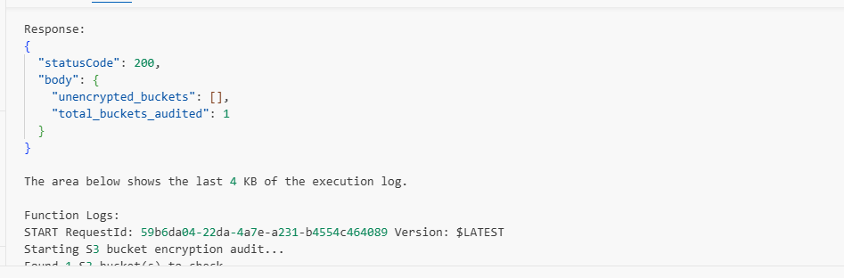 |
| 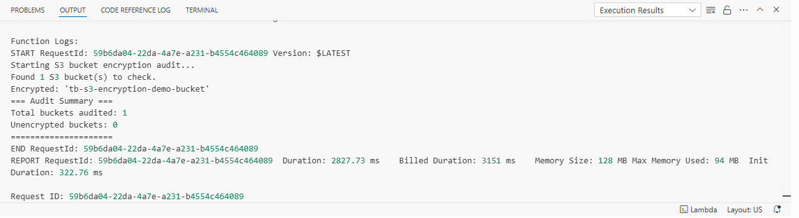 | |

</details>

---

## Overview

All step-by-step screenshots are embedded inside each respective section above. You can expand the dropdown panels under each step to see:
- **Step 1**: S3 bucket creation and disabling encryption on one bucket using AWS CloudShell to simulate an unencrypted bucket.
- **Step 2**: Configuration of the IAM role with `AmazonS3ReadOnlyAccess` policy to allow Lambda to list S3 buckets.
- **Step 3**: Lambda function creation, code deployment, and environment settings.
- **Step 4**: Testing the Lambda function and auditing the encryption status results.
